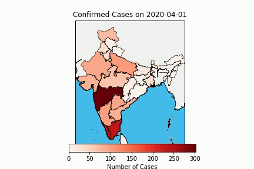

# Coronavirus-Time-Space-Spread-India
Creates a Time Space Map Video for Confirmed Coronavirus Case Spread in India - starting from March 10 2020

Dataset obtained from COVID-19 India API [https://github.com/covid19india/api], a volunteer-driven API for COVID-19 stats in India.

Attached Data.json contains Coronavirus Data for India between March 10 2020 to April 11 2020

To get the latest data, use the following curl command in the project directory [INDIA/]:

curl --request GET 'https://api.rootnet.in/covid19-in/s/history.json' > data.json

AVI video files are accordingly created after executing time-map.ipynb

 Demo
------
With color-map changing based on confirmed cases on that particular day

With color-map constant over entire video based on current total confirmed cases

